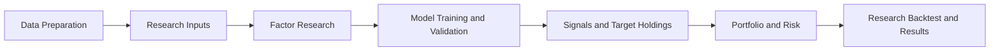

# Quantitative Research Workbench

A Share Quantitative Research Platform

这是一个面向 A 股研究的端到端量化研究工作台。项目将数据准备、因子研究、机器学习、信号与持仓、组合构建、风险估计和历史回测整合在同一条可审计流程中，重点处理数据可信度、时序泄漏、实验复现和研究任务管理。

This is an end-to-end quantitative research workbench for China A-shares. It brings data preparation, factor research, machine learning, signals and holdings, portfolio construction, risk estimation, and historical backtesting into one auditable workflow, with an emphasis on data integrity, temporal leakage prevention, experiment reproducibility, and research task management.

## 项目概览

平台面向希望搭建严谨研究流程的量化研究者、开发者和学习者。它覆盖从 TuShare 数据接入到 Artifact 结果查看的完整研究链路，并通过历史时点股票池、Coverage Ledger、walk-forward 划分和 exact `run_id` 降低常见的数据与复现风险。

The platform is intended for researchers, developers, and learners who need a disciplined quantitative workflow. It covers the path from TuShare ingestion to Artifact-backed results, using point-in-time universes, a Coverage Ledger, walk-forward splits, and exact `run_id` resolution to reduce common data and reproducibility risks.

项目是本地研究平台，不是实盘交易系统。它不连接券商、不提交订单，也不提供实时行情或生产级交易风控。

This is a local research platform, not a live trading system. It does not connect to brokers, submit orders, provide real-time market data, or implement production trading controls.

## 主要功能

- 在工作台中显式选择 TuShare 官方接口或第三方代理接口；Provider 彼此隔离，不自动切换。
  Explicit selection between the official TuShare API and a third-party proxy; providers remain isolated and never fail over automatically.
- 使用数据契约、主键与字段校验、Provider 质量检查和安全错误分类保护数据边界。
  Data contracts, key and field validation, provider quality checks, and sanitized error classification protect the ingestion boundary.
- 分离 RAW 响应与分区 CURATED Parquet，并使用 SQLite Coverage Ledger 记录精确覆盖单元。
  RAW responses are separated from partitioned CURATED Parquet, while a SQLite Coverage Ledger records exact coverage units.
- 支持 CUSTOM、INDEX 和 ALL_A_SHARES 历史时点股票池，按上市与退市生命周期解析成员，避免用当前成分回填历史。
  Point-in-time CUSTOM, INDEX, and ALL_A_SHARES universes apply listing and delisting lifecycles without backfilling history from current constituents.
- 计算并预处理因子，执行 RankIC、分组收益等因子评价，并支持静态或动态因子组合。
  Factor calculation and preprocessing feed RankIC, grouped-return evaluation, and static or dynamic factor composition.
- 提供 `ridge`、`elastic_net` 和 `hist_gradient_boosting` 三种已注册的 scikit-learn 模型。
  The registered scikit-learn models are `ridge`, `elastic_net`, and `hist_gradient_boosting`.
- 使用 walk-forward 训练、Purge、Embargo、标签可用性约束和严格样本外预测控制时序泄漏。
  Walk-forward training, purge and embargo windows, label-availability guards, and strict out-of-sample predictions control temporal leakage.
- 从预测生成信号、Top-N 选择和目标持仓，并保留上游 Artifact 血缘。
  Predictions flow into signals, Top-N selection, and target holdings with upstream Artifact lineage preserved.
- 支持等权、排序加权、逆波动率和最小方差组合；风险估计包括样本协方差和 Ledoit-Wolf。
  Portfolio weighting includes equal weight, rank weight, inverse volatility, and minimum variance, with sample covariance and Ledoit-Wolf risk estimators.
- 研究回测处理再平衡、交易成本、净值、基准和风险指标，并区分严格停牌事件与标准稳健模式。
  The research backtest handles rebalancing, transaction costs, NAV, benchmarks, and risk metrics, with distinct strict-event and standard-robust suspension modes.
- Streamlit 工作台提供中英文界面、后台研究任务、真实阶段进度、安全失败诊断、重试、任务记录和结果页。
  The bilingual Streamlit workbench provides background research tasks, real stage progress, safe failure diagnostics, retries, task history, and result views.
- 通过 `run_id`、配置快照、manifest、内容 hash 和经校验的 Artifact 精确复查结果。
  Exact result review is based on `run_id`, configuration snapshots, manifests, content hashes, and validated Artifacts.

## 工作流程

平台 UI 只负责配置、调度和展示；因子、模型、组合、风险与回测计算仍由后端模块及其契约负责。

The UI is limited to configuration, orchestration, and presentation. Factor, model, portfolio, risk, and backtest calculations remain owned by backend modules and their contracts.



数据准备 → 研究输入 → 因子研究 → 模型训练与验证 → 信号与目标持仓 → 组合与风险 → 研究回测与结果

Data preparation → research inputs → factor research → model training and validation → signals and target holdings → portfolio and risk → research backtest and results

## 项目结构

- `app/`：Streamlit 入口、五页工作台、双语界面和任务服务。
  Streamlit entry point, five-page workbench, bilingual UI, and task services.
- `src/data/`：Provider、数据契约、准备流程、Parquet 存储和 Coverage Ledger。
  Providers, data contracts, preparation, Parquet storage, and the Coverage Ledger.
- `src/universe/` 与 `src/research_data/`：历史时点股票池、研究日历、复权价格和研究输入物化。
  Point-in-time universes, research calendars, adjusted prices, and research-input materialization.
- `src/factors/`：因子注册、计算、预处理、评价和组合。
  Factor registration, calculation, preprocessing, evaluation, and composition.
- `src/ml/`：数据集契约、walk-forward 划分、模型训练、评价和 Artifact。
  Dataset contracts, walk-forward splitting, model training, evaluation, and Artifacts.
- `src/signals/` 与 `src/holdings/`：信号排序、选择和目标持仓。
  Signal ranking, selection, and target holdings.
- `src/portfolio_construction/` 与 `src/risk_model/`：权重策略、约束、协方差估计和最小方差优化。
  Weighting strategies, constraints, covariance estimation, and minimum-variance optimization.
- `src/research_backtest/`：再平衡、可交易性、收益核算、成本、指标和结果 Artifact。
  Rebalancing, availability, return accounting, costs, analytics, and result Artifacts.
- `docs/`：数据层、股票池、工作台和各研究阶段的详细设计说明。
  Detailed design notes for the data layer, universes, workbench, and research stages.
- `tests/`：单元、集成和界面契约测试。
  Unit, integration, and UI contract tests.

## 快速开始

仓库当前验证环境为 Windows 和 Python 3.12.2；Python 版本尚未通过 `pyproject.toml` 强制限定，其他版本和平台需要单独验证。详细依赖策略见 [Dependency Policy](docs/06_dependency_policy.md)。

The repository is currently validated on Windows with Python 3.12.2. A Python range is not enforced through `pyproject.toml`, so other versions and platforms require separate validation. See the [Dependency Policy](docs/06_dependency_policy.md) for details.

1. 创建并激活虚拟环境。
   Create and activate a virtual environment.

   ```powershell
   python -m venv .venv
   .\.venv\Scripts\Activate.ps1
   ```

2. 按仓库已验证的核心约束安装依赖。
   Install dependencies with the repository's validated core constraints.

   ```powershell
   python -m pip install --upgrade pip
   python -m pip install -r requirements.txt -c constraints-v3-core.txt
   ```

3. 安全配置 TuShare Token。推荐在工作台侧栏的密码输入框中本地输入，Token 仅保留在当前会话。官方接口也支持复制示例文件后在本地填写 `.env`；该文件已被 Git 忽略。不要提交、截图或记录真实 Token。
   Configure the TuShare token securely. Prefer entering it locally in the workbench password field, where it remains session-only. The official provider can also read a local `.env` copied from the example; Git already ignores that file. Never commit, capture, or log a real token.

   ```powershell
   Copy-Item .env.example .env
   ```

   ```text
   TUSHARE_TOKEN=your_tushare_token_here
   ```

4. 启动 Streamlit 工作台。
   Start the Streamlit workbench.

   ```powershell
   python -m streamlit run app/streamlit_app.py
   ```

   也可以运行 `run_app.bat`、`run_app.ps1`，或在 Windows 资源管理器中启动仓库自带的 `QuantResearchWorkbench.exe`。这些入口最终都启动同一个 `app/streamlit_app.py`。
   You can also run `run_app.bat`, `run_app.ps1`, or launch the included `QuantResearchWorkbench.exe` from Windows Explorer. All of these entry points start the same `app/streamlit_app.py` application.

## 使用方法

1. 在侧栏选择中文或 English，并明确选择官方或代理 Provider；代理是第三方服务，工作台不会自动回退或切换。
   Choose Chinese or English in the sidebar and explicitly select the official or proxy provider. The proxy is third-party, and the workbench never switches providers automatically.
2. 在本地密码框输入对应 Token；如果本地规范数据已完整，可在不调用 Provider 的情况下复用。
   Enter the matching token locally. Complete canonical local coverage can be reused without a provider call.
3. 打开 New Run 创建研究任务。任务在后台执行，页面切换或刷新不会中断当前进程中的任务。
   Open New Run and create a research task. It runs in the background, so navigation or refresh does not interrupt it within the current process.
4. 配置研究日期、CUSTOM/INDEX/ALL_A_SHARES 股票池、DAILY/MONTHLY 频率、因子、模型、Top-N、组合方式和回测参数。
   Configure dates, a CUSTOM/INDEX/ALL_A_SHARES universe, DAILY/MONTHLY frequency, factors, model, Top-N selection, portfolio method, and backtest settings.
5. 在 Data Readiness 和任务页查看缺失覆盖、数据准备、因子、建模、信号、组合和回测的真实阶段进度。
   Review missing coverage in Data Readiness and follow real preparation, factor, modeling, signal, portfolio, and backtest stages on the task page.
6. 如果任务失败，查看经过脱敏的失败阶段、数据集、区间和恢复建议；修复权限、网络、数据或配置问题后使用 Retry。
   If a task fails, inspect the sanitized stage, dataset, range, and recovery guidance, then use Retry after correcting credential, network, data, or configuration issues.
7. 对成功任务选择 View Results，或从 Research Tasks 使用精确 `run_id` 重新打开结果，检查指标、持仓、收益、配置和 Artifact 血缘。
   For a successful task, choose View Results or reopen it from Research Tasks by exact `run_id` to inspect metrics, holdings, returns, configuration, and Artifact lineage.

工作台的完整交互与结果读取契约见 [Workbench First-Run Integration](docs/23_workbench_first_run_integration.md) 和 [Artifact-Backed Results](docs/17_research_workbench_results.md)。

See [Workbench First-Run Integration](docs/23_workbench_first_run_integration.md) and [Artifact-Backed Results](docs/17_research_workbench_results.md) for the full interaction and result-loading contracts.

## 数据与可复现性

Provider 标识参与数据身份，官方与代理数据不会静默混用。Coverage Ledger 以数据集、scope 和精确时间单元记录完成状态，重复研究只补充缺失覆盖。历史指数成分和股票生命周期按 formation date 解析，避免把未来可见信息带回过去。

Provider identity is part of data identity, preventing silent mixing of official and proxy data. The Coverage Ledger records completion by dataset, scope, and exact time unit, so repeated research requests only missing coverage. Historical index membership and security lifecycles are resolved at each formation date rather than filled from future knowledge.

数据与研究输入先写入临时位置、重新读取并校验，再原子发布。每次成功运行保存配置快照、manifest、schema、内容 hash 和上游 lineage；结果页只解析指定 `run_id` 下经过验证的 Artifact，不使用文件时间或模糊的 latest 回退。

Data and research inputs are staged, read back, validated, and then published atomically. Each successful run records configuration snapshots, manifests, schemas, content hashes, and upstream lineage. Results resolve only validated Artifacts under the requested `run_id`, without filesystem-time or fuzzy latest fallbacks.

更多实现细节见 [Data Layer](docs/19_data_layer_2_0.md)、[Point-in-Time Universe](docs/20_universe_1_0.md) 和 [TuShare Provider Contracts](docs/24_tushare_provider_contracts.md)。

For implementation details, see the [Data Layer](docs/19_data_layer_2_0.md), [Point-in-Time Universe](docs/20_universe_1_0.md), and [TuShare Provider Contracts](docs/24_tushare_provider_contracts.md).

## 当前边界

- 项目定位为历史量化研究平台，不连接券商实盘交易，也不负责订单执行。
  The project is a historical quantitative research platform; it does not connect to live brokerage trading or execute orders.
- 数据可用性取决于所选 Provider 的状态、TuShare Token 权限、积分和接口返回质量。
  Data availability depends on the selected provider, TuShare token permissions and points, and endpoint response quality.
- 严格停牌事件模式依赖 `suspend_d` 接口的相应权限与完整覆盖；标准稳健模式不会把缺失行情自动宣称为已确认停牌。
  Strict suspension-event mode depends on permission and complete coverage for `suspend_d`; standard-robust mode does not label every missing quote as a confirmed suspension.
- 当前机器学习能力以仓库注册的 scikit-learn 模型为主；LightGBM 和 XGBoost 未安装、未声明，也不属于当前支持范围。
  Current machine-learning support is centered on the registered scikit-learn models. LightGBM and XGBoost are not installed, declared, or supported.
- 依赖约束记录的是已验证核心环境，不是完整 lock file；其他操作系统需要另行验证。
  Dependency constraints record the validated core environment rather than a complete lock file; other operating systems require separate validation.
- 历史回测和模型输出不代表未来表现，不构成投资建议。
  Historical backtests and model outputs do not represent future performance and are not investment advice.

## License

项目采用 [MIT License](LICENSE)。

This project is licensed under the [MIT License](LICENSE).
