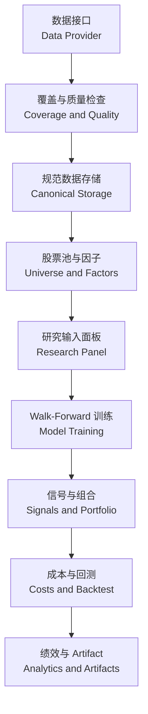
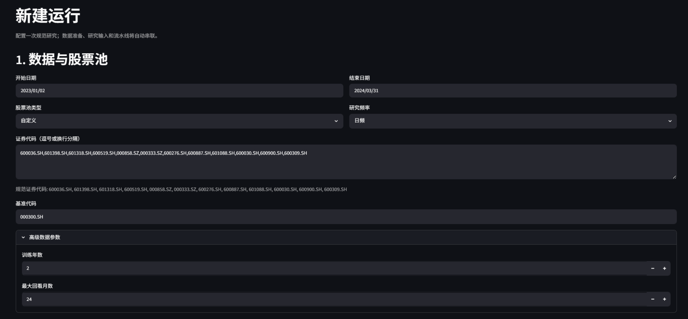
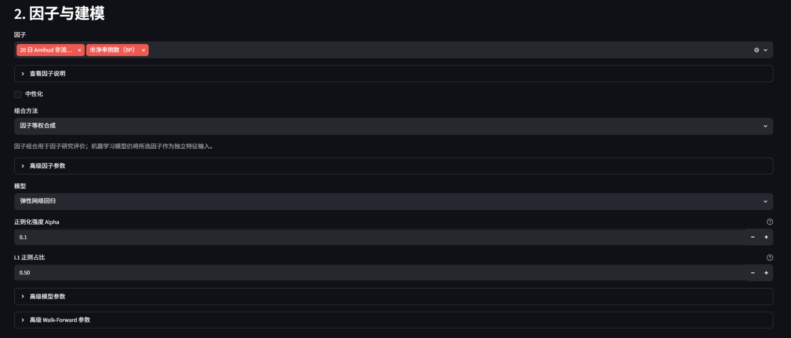
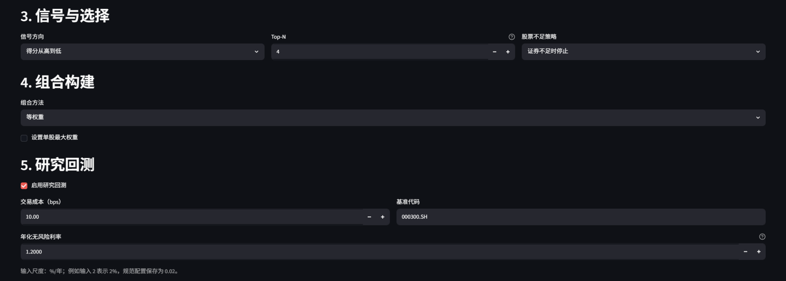
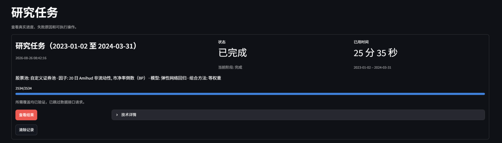
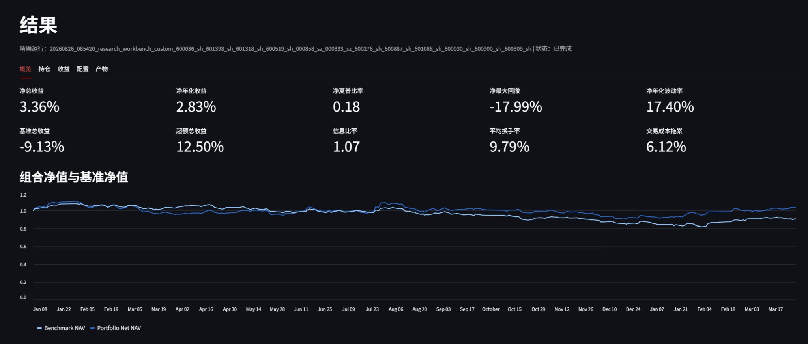
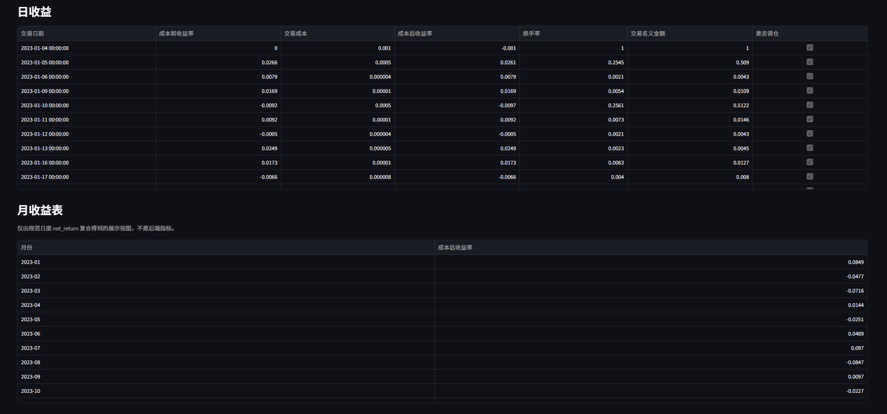

# Quantitative Research Workbench
# 量化研究工作台

面向中国股票市场的可复现量化研究工作台，将数据管理、因子研究、机器学习、信号生成、组合构建、交易成本、研究回测和结果持久化整合在同一套流程中。

A reproducible quantitative research workbench for China A-shares, integrating data management, factor research, machine learning, signal generation, portfolio construction, transaction costs, backtesting, and persistent research outputs in one workflow.

[](https://github.com/123-luk/Quantitative-Research-Workbench/actions/workflows/tests.yml)
[](https://www.python.org/downloads/release/python-3120/)
[](LICENSE)

## 项目为什么值得看
## Why This Project Is Worth Exploring

该项目不是单一策略回测脚本，而是一套从数据覆盖检查到研究结果持久化的完整研究流程。系统将数据质量、时间序列训练、因子研究、模型预测、组合构建和绩效分析连接起来，并保留配置、运行记录和研究产物，以支持研究复现和后续扩展。

This is more than a single-strategy backtest script. It connects data coverage and quality controls, time-aware model training, factor research, predictions, portfolio construction, and performance analysis, while preserving configurations, run records, and validated artifacts for reproducibility and extension.

项目定位为本地历史研究平台，不连接券商、不提交订单，也不提供实时行情或生产级交易风控。

The workbench is designed for local historical research. It does not connect to brokers, submit orders, provide real-time quotes, or implement production trading controls.

## 主要功能
## Core Capabilities

1、数据接口：在工作台中显式选择 TuShare 官方接口或第三方代理接口。两个 Provider 独立管理，数据身份彼此隔离，不自动回退或混用。

Provider management: explicitly choose the official TuShare API or a third-party proxy. Provider identities remain isolated, with no silent failover or data mixing.

2、数据管理：保存 RAW 响应和分区 canonical Parquet，使用 Coverage Ledger 记录精确覆盖单元，并通过数据契约、主键、字段、质量和读回检查保证规范数据可复用。

Data management: persist raw responses and partitioned canonical Parquet, track exact coverage units in the Coverage Ledger, and validate contracts, keys, fields, quality, and readback before reuse.

3、因子研究：提供估值、流动性、动量、反转、波动率等因子，并支持注册扩展、预处理、RankIC、分组收益和静态或动态因子组合。

Factor research: study valuation, liquidity, momentum, reversal, volatility, and extensible registered factors with preprocessing, RankIC, grouped returns, and static or dynamic composition.

4、机器学习：注册 Ridge、ElasticNet 和直方图梯度提升模型，使用统一数据集、训练、预测、评价和 Artifact 接口。

Machine learning: run Ridge, ElasticNet, and histogram gradient boosting through shared dataset, training, prediction, evaluation, and artifact interfaces.

5、时序验证：使用 Walk-Forward 滚动训练验证、Purge 重叠样本清除、Embargo 隔离期、标签可用性约束和严格样本外预测降低时序泄漏风险。

Time-aware validation: combine walk-forward training, overlap purging, embargo windows, label-availability guards, and strict out-of-sample predictions to reduce temporal leakage.

6、信号与选股：按照模型评分和可配置方向生成信号，执行 Top-N 选择，并在证券数量不足时按配置停止，避免静默改变研究假设。

Signals and selection: turn model scores into directional signals and Top-N selections, with fail-closed handling when the eligible universe cannot satisfy the requested portfolio size.

7、组合构建：支持等权、排序加权、逆波动率和最小方差，并提供样本协方差、Ledoit-Wolf 风险估计和组合约束。

Portfolio construction: support equal, rank, inverse-volatility, and minimum-variance weighting with sample covariance, Ledoit-Wolf estimation, and portfolio constraints.

8、回测分析：处理调仓、可交易性、换手率和交易成本，输出组合与基准净值、收益、回撤、波动率、夏普比率、信息比率及调仓记录。

Backtest analytics: account for rebalancing, tradability, turnover, and transaction costs, then report portfolio and benchmark NAV, returns, drawdowns, volatility, Sharpe ratio, information ratio, and rebalance records.

9、研究产物：持久化净值、收益、回撤、持仓、模型、信号、配置、manifest、schema、内容 hash 和上游 lineage，并通过精确运行标识读取经校验的 Artifact。

Research artifacts: persist NAV, returns, drawdowns, holdings, models, signals, configuration, manifests, schemas, content hashes, and upstream lineage, with exact-run validated artifact loading.

10、应用服务：Streamlit 中英文界面支持后台研究任务、真实阶段进度、失败诊断、任务重试、历史任务和持久化结果查看。

Application services: the bilingual Streamlit interface provides background jobs, real stage progress, sanitized failure diagnostics, retries, task history, and persistent result views.

## 系统流程
## Research Flow



数据接口 → 数据覆盖与质量检查 → 规范数据存储 → 股票池构建 → 因子计算 → 研究输入面板 → Walk-Forward 模型训练 → 信号生成 → 组合构建 → 成本与回测 → 绩效分析 → Artifact 持久化

Data provider → coverage and quality checks → canonical storage → universe construction → factor calculation → research panel → walk-forward training → signals → portfolio construction → costs and backtest → analytics → artifact persistence

## 项目结构
## Architecture

1、`src/data/` 是数据层，包含 Provider、数据契约、Coverage Ledger、准备流程和 Parquet 存储。

2、`src/universe/`、`src/research_data/` 和 `src/factors/` 构成股票池、研究输入与因子研究层。

3、`src/ml/`、`src/modeling_panel/` 和 `src/pipeline/` 负责机器学习、时序验证与研究流水线。

4、`src/signals/`、`src/holdings/`、`src/portfolio_construction/` 和 `src/risk_model/` 负责信号、持仓、权重与风险估计。

5、`src/research_backtest/` 负责调仓、收益、成本、绩效和结果 Artifact。

6、`app/services/` 和 `app/views/` 提供任务服务、结果读取与 Streamlit 界面。

7、`tests/` 和 `docs/` 保存离线测试及数据层、股票池、研究阶段和工作台设计说明。

Together, these directories separate the data, factor, modeling, signal, portfolio, backtest, application, interface, testing, and documentation responsibilities without hiding the lineage between stages.

## 快速开始
## Quick Start

### 1、下载 Windows 版本

从 [GitHub Releases](https://github.com/123-luk/Quantitative-Research-Workbench/releases) 下载 `QuantResearchWorkbench.exe` 和同版本的 `QuantResearchWorkbench.exe.sha256`，核对 SHA-256 后启动程序。构建产物不直接存放在源码仓库中。

Download `QuantResearchWorkbench.exe` and its matching `QuantResearchWorkbench.exe.sha256` from [GitHub Releases](https://github.com/123-luk/Quantitative-Research-Workbench/releases), verify the checksum, and launch the application. Built executables are distributed separately from source control.

### 2、从源码运行

仓库验证环境为 Windows 和 Python 3.12。其他 Python 版本和操作系统需要单独验证。依赖策略见 [Dependency Policy](docs/06_dependency_policy.md)。

```powershell
git clone https://github.com/123-luk/Quantitative-Research-Workbench.git
cd Quantitative-Research-Workbench
python -m venv .venv
.\.venv\Scripts\Activate.ps1
python -m pip install --upgrade pip
python -m pip install -r requirements.txt -c constraints-v3-core.txt
python -m streamlit run app/streamlit_app.py
```

The repository is validated on Windows with Python 3.12. Other Python versions and operating systems require separate verification.

### 3、完成一次研究

1、在侧栏选择中文或 English，并明确选择 TuShare 官方或代理 Provider。代理是第三方服务，工作台不会自动切换接口。

2、在本地密码输入框中输入对应 Token。Token 仅保留在当前会话，不应提交、截图或写入公开文档。规范数据覆盖完整时，研究可以直接复用本地数据。

3、打开 New Run，配置日期、日频或月频、CUSTOM、INDEX 或 ALL_A_SHARES 股票池、因子、模型、Top-N、组合方式和回测参数，然后创建后台任务。

4、在 Data Readiness 和任务页查看覆盖检查、数据准备、因子、建模、信号、组合和回测进度。失败时按照脱敏诊断修复数据、权限、网络或配置问题后重试。

5、任务成功后选择 View Results，从结果页检查指标、净值、回撤、持仓、调仓、收益、配置和 Artifact 血缘；历史任务也可以再次打开已持久化结果。

The same five-step path is available in English: select a provider, enter the token locally, configure and create a run, follow stage progress, and open the persisted results.

## 数据设计与可复现性
## Data Design and Reproducibility

1、Provider 标识参与数据身份，官方与代理数据不会静默混用。Coverage Ledger 按数据集、scope 和精确时间单元记录完成状态，重复研究只请求缺失覆盖。

2、历史指数成分和证券生命周期按形成日解析，避免使用当前成分回填历史。研究日历、复权价格、因子回看、标签期限和模型历史区间分别进入数据需求规划。

3、数据和研究输入先写入临时位置、重新读取并校验，再原子发布。成功运行保存配置快照、manifest、schema、内容 hash 和上游 lineage。

4、结果服务只读取指定运行下经过验证的 Artifact，不依赖文件时间或模糊的 latest 回退。完整交互和读取契约见 [Workbench First-Run Integration](docs/23_workbench_first_run_integration.md) 与 [Artifact-Backed Results](docs/17_research_workbench_results.md)。

Provider identity, point-in-time membership, staged validation, atomic publication, content hashes, lineage, and exact-run resolution make repeated research inspectable rather than merely repeatable by convention.

## 研究流程示例
## Research Workflow Example

下面通过一个小规模日频研究案例展示工作台的基本操作、任务执行和研究产出。该案例用于说明系统能够完成完整研究流程，不代表程序只能使用这些参数，也不代表该策略已经具有稳定的样本外盈利能力。

The following small daily-frequency study demonstrates the workbench workflow, task execution, and persisted outputs. It is an operational example, not a claim that the system is limited to these settings or that the strategy has stable out-of-sample profitability.

### 1、数据与股票池



案例选择日频研究，以 12 只沪深股票组成小规模自定义股票池，并以沪深300指数作为比较基准。训练年数和最大回看期用于为模型训练与因子计算准备额外历史数据，因此界面中的请求区间不等于系统只读取这一段数据。

This daily example uses a 12-stock custom universe and the CSI 300 as benchmark. Training years and maximum lookback extend the historical context required by model training and factor calculation.

### 2、因子与模型



案例选择 20 日 Amihud 非流动性因子和市净率倒数 BP。BP 描述估值水平，Amihud 因子描述价格变动相对于成交金额的流动性特征。机器学习阶段使用 ElasticNet，将两个因子作为独立特征，通过 L1 和 L2 正则化控制模型复杂度。

Alpha 0.1 和 L1 正则占比 0.50 是本次示例的固定配置，不是经过证明的最优参数。高级因子、模型和 Walk-Forward 参数在界面中保持折叠。

The model uses the selected factors as ElasticNet features. Alpha 0.1 and an L1 ratio of 0.50 are fixed demonstration settings, not optimized claims.

### 3、信号、组合与回测



模型预测得分从高到低排序，每个形成期选择 Top 4 股票，并按等权构建组合。Top 4 与 12 只股票的小规模演示池相匹配，只是示例配置，不代表适用于所有股票池的最优持仓数量。

回测使用沪深300作为基准，显式计入 10 bps 交易成本，并采用 1.2% 年化无风险利率。“证券不足时停止”表示系统不会在股票池证据不足时静默生成不符合配置的组合。

Scores are ranked from highest to lowest, four securities are selected at each formation date, and the portfolio is equally weighted. The backtest uses the CSI 300 benchmark, 10 bps transaction costs, and a 1.2% annual risk-free rate.

### 4、任务完成



任务完成全部 2534 个数据覆盖单元的检查，并生成可以再次打开和持久化读取的研究结果。本次任务复用了已验证的本地数据，因此跳过了重复的数据接口请求。

The task completed all 2,534 coverage checks and persisted reopenable research results. Verified local data was reused, so duplicate provider requests were skipped.

### 5、研究结果



净总收益为 3.36%，净年化收益为 2.83%，净夏普比率为 0.18，净最大回撤为 -17.99%，净年化波动率为 17.40%。基准总收益为 -9.13%，超额总收益为 12.50%，信息比率为 1.07，平均换手率为 9.79%，交易成本拖累为 6.12%。

该案例在研究区间内取得正收益并跑赢基准，但夏普比率较低，最大回撤和交易成本影响仍然明显。该结果主要用于展示系统能够完成从数据准备、因子计算和模型训练，到信号、组合、成本建模、回测和研究结果持久化的完整流程，不能被解释为策略已经具备稳定盈利能力。

The example produced a positive return and outperformed its benchmark over the displayed interval, while its low Sharpe ratio, drawdown, and cost drag remain material. The result demonstrates the complete software workflow and should not be interpreted as evidence of stable profitability.

<details>
<summary>风险、成本与收益明细 / Risk, Cost and Return Details</summary>

系统进一步输出组合与基准净值、回撤序列、每日成本前收益、交易成本、每日成本后收益、换手率、交易名义金额和调仓记录。



月收益表由日度净收益复合得到，用于按月展示研究区间内的收益分布，不是独立的后验绩效指标。

The detailed views include portfolio and benchmark NAV, drawdown, daily gross return, cost, daily net return, turnover, traded notional, rebalance records, and monthly displays compounded from daily net returns.

</details>

该案例仅用于软件功能和研究流程展示，不构成投资建议。历史回测结果不能保证未来表现，小规模自定义股票池也可能存在选择偏差。

This example demonstrates the software workflow and research outputs only. It does not constitute investment advice, and historical backtest results do not guarantee future performance.

## 研究边界与扩展空间
## Research Boundaries and Extensions

1、平台服务于历史量化研究，不负责实时行情、券商连接、订单执行和生产级交易风控。后续实盘化需要独立的执行、合规、监控和故障恢复体系。

2、数据可用性取决于所选 Provider 的状态、Token 权限、积分和返回质量。严格停牌事件模式还依赖 `suspend_d` 的权限与完整覆盖；标准稳健模式不会把缺失行情自动认定为已确认停牌。

3、当前机器学习能力以已注册的 scikit-learn 模型为主。LightGBM、XGBoost 和深度学习模型未安装或声明，可以通过现有模型注册与 Artifact 契约扩展，但需要重新验证依赖和时序研究设计。

4、依赖约束记录已验证的核心环境，不是完整 lock file。其他操作系统、大规模股票池、更多市场和更长区间需要单独进行资源、数据质量和数值稳定性验证。

5、任何因子、模型和回测结论都受样本选择、参数搜索、交易成本、市场制度和数据修订影响。历史结果不代表未来表现，也不构成投资建议。

These boundaries keep the current claims precise while leaving clear extension points for new providers, factors, models, optimizers, markets, and execution infrastructure.

## License

项目采用 [MIT License](LICENSE)。

This project is licensed under the [MIT License](LICENSE).
